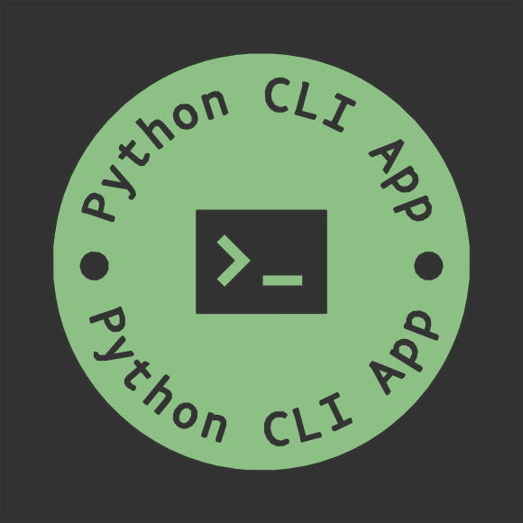

# {{ cookiecutter.project_name }}

{{ cookiecutter.project_short_description }}

Read [Features] for overview.

## Navigation

Documentation for specific `MAJOR.MINOR` versions can be chosen by using the dropdown on the Flyout menu
(on the moment of writing it is displayed in the lower right corner of ReadTheDocs).

The `latest` version reflects changes that have not yet been released.

Shortcuts can be used for navigation, i.e. <kbd>,</kbd>/<kbd>p</kbd> and <kbd>.</kbd>/<kbd>n</kbd> for
previous and next page, respectively, as well as <kbd>/</kbd>/<kbd>s</kbd> for searching.

[Features]: features.md
